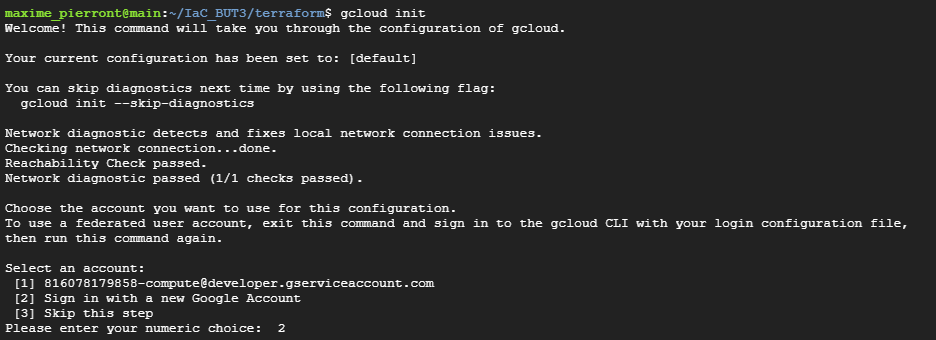
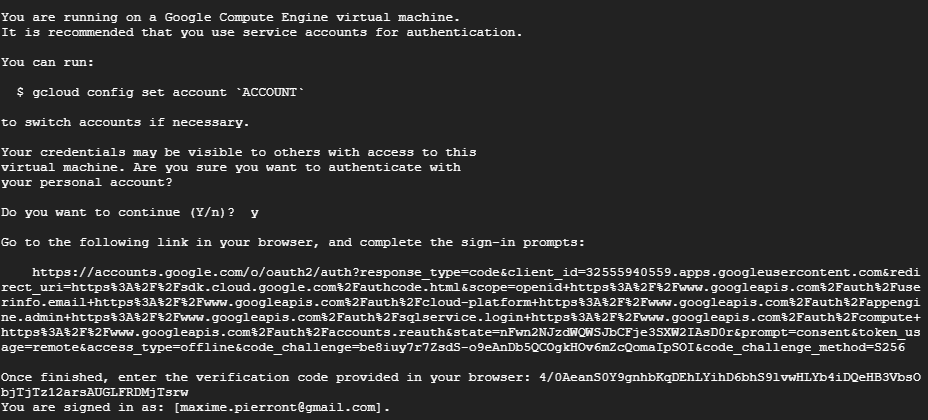
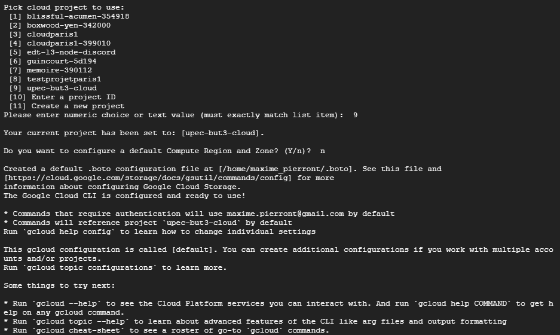
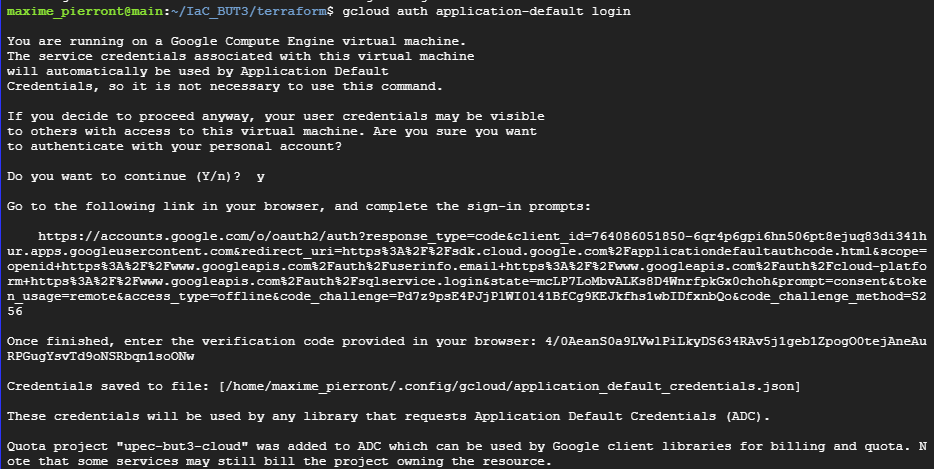

# IaC_BUT3

activer api : Identity and Access Management (IAM) API
activer api : Cloud Resource Manager API

sudo apt install git
`git clone https://github.com/MaximePIERRONT/IaC_BUT3.git`

ssh-keygen -t rsa -f ~/.ssh/id_ed25519 -C <john_doe_gmail_com>
replace "." & "@" with "_"

## install terraform

[https://www.hashicorp.com/official-packaging-guide?product_intent=terraform](https://www.hashicorp.com/official-packaging-guide?product_intent=terraform)

`sudo apt update && sudo apt install gpg`

`wget -O- https://apt.releases.hashicorp.com/gpg | sudo gpg --dearmor -o /usr/share/keyrings/hashicorp-archive-keyring.gpg`

`gpg --no-default-keyring --keyring /usr/share/keyrings/hashicorp-archive-keyring.gpg --fingerprint`

`echo "deb [arch=$(dpkg --print-architecture) signed-by=/usr/share/keyrings/hashicorp-archive-keyring.gpg] https://apt.releases.hashicorp.com $(lsb_release -cs) main" | sudo tee /etc/apt/sources.list.d/hashicorp.list`

`sudo apt update
sudo apt install terraform`

sudo apt install ansible
sudo apt install -y python3-google-auth python3-requests python3-google-auth-httplib2 python3-googleapi

cd terraform

change default variables in variables.tf
terraform init
terraform plan

verfier l'inventory

ansible-inventory --list

